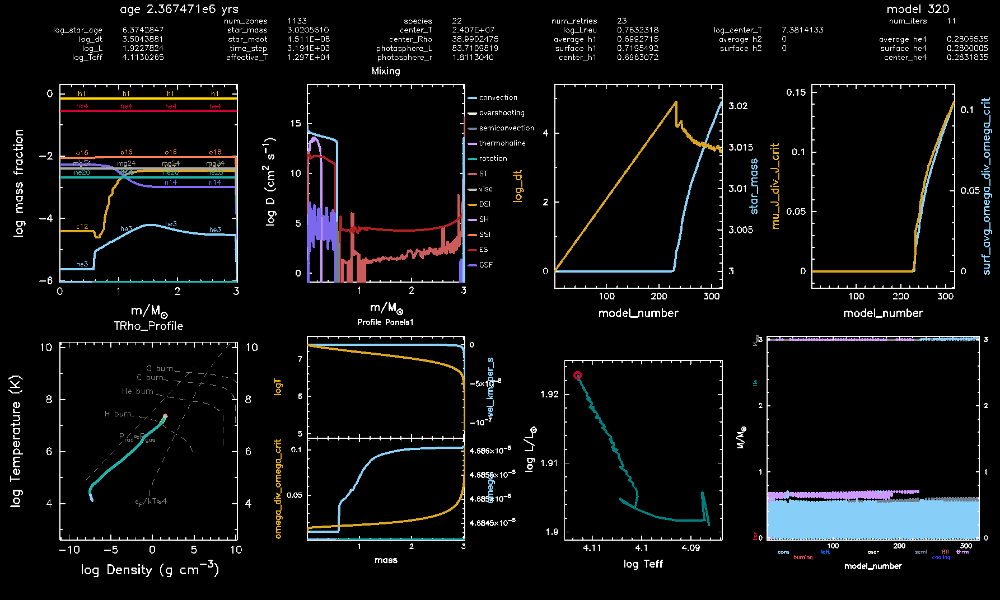

# MESA: Stellar Evolution in AGN Disks
Extensions to Module for Experiments in Stellar Astrophysics used to calculate the evolution of stars in AGN disks (AGN Stars).
This one includes modifications from Alex Dittmann and Eb Farag. It's ported to MESA r24.08.1.
It also implements the self-consistent accretion of angular momentum from the accreting stream according to Jermyn et al. 2021 in the stellar calculation, so that one can track rotational mixing self-consistently.  

